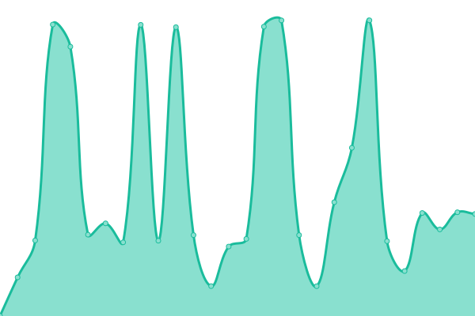
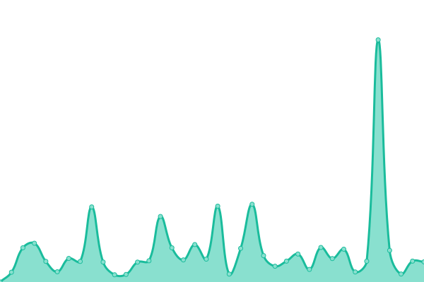
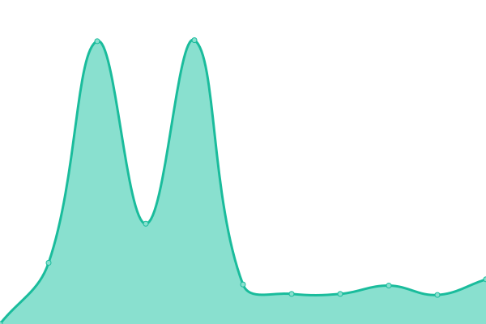
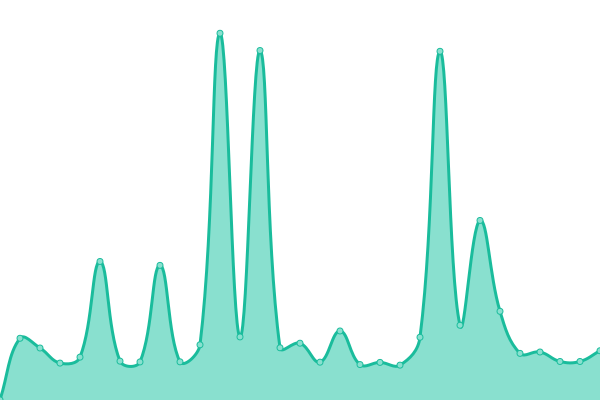
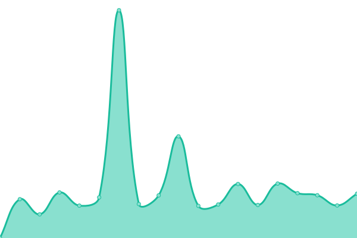
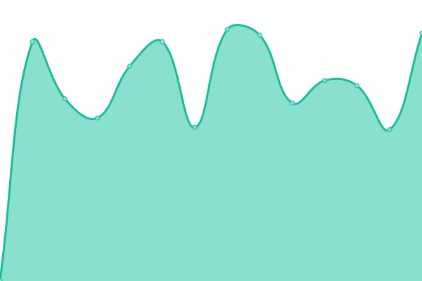

# [📈 Live Status](https://monitoring.eighty-three.me): <!--live status--> **🟧 Partial outage**

This repository contains the open-source uptime monitor and status page for [Thomas Deutsch](https://monitoring.eighty-three.me), powered by [Upptime](https://github.com/upptime/upptime).

With [Upptime](https://upptime.js.org), you can get your own unlimited and free uptime monitor and status page, powered entirely by a GitHub repository. We use [Issues](https://github.com/tuxpeople/monitoring/issues) as incident reports, [Actions](https://github.com/tuxpeople/monitoring/actions) as uptime monitors, and [Pages](https://monitoring.eighty-three.me) for the status page.

<!--start: status pages-->
<!-- This summary is generated by Upptime (https://github.com/upptime/upptime) -->
<!-- Do not edit this manually, your changes will be overwritten -->
<!-- prettier-ignore -->
| URL | Status | History | Response Time | Uptime |
| --- | ------ | ------- | ------------- | ------ |
|  [Plex](http://plex.eighty-three.me:32400/identity) | 🟩 Up | [plex.yml](https://github.com/tuxpeople/monitoring/commits/HEAD/history/plex.yml) | 

 296ms
     
 | 

<a href="https://monitoring.eighty-three.me/history/plex">100.00%</a>
    

|  [Wallabag](https://wallabag.eighty-three.me) | 🟥 Down | [wallabag.yml](https://github.com/tuxpeople/monitoring/commits/HEAD/history/wallabag.yml) | 

 2263ms
     
 | 

<a href="https://monitoring.eighty-three.me/history/wallabag">36.15%</a>
    

|  [Code Server](https://code.eighty-three.me) | 🟥 Down | [code-server.yml](https://github.com/tuxpeople/monitoring/commits/HEAD/history/code-server.yml) | 

 2159ms
     
 | 

<a href="https://monitoring.eighty-three.me/history/code-server">0.00%</a>
    

|  [Grafana](https://grafana.eighty-three.me) | 🟥 Down | [grafana.yml](https://github.com/tuxpeople/monitoring/commits/HEAD/history/grafana.yml) | 

 2854ms
     
 | 

<a href="https://monitoring.eighty-three.me/history/grafana">0.00%</a>
    

|  [Alertmanager](https://alertmanager.eighty-three.me) | 🟥 Down | [alertmanager.yml](https://github.com/tuxpeople/monitoring/commits/HEAD/history/alertmanager.yml) | 

 2260ms
     
 | 

<a href="https://monitoring.eighty-three.me/history/alertmanager">0.00%</a>
    

|  [Prometheus](https://prometheus.eighty-three.me) | 🟥 Down | [prometheus.yml](https://github.com/tuxpeople/monitoring/commits/HEAD/history/prometheus.yml) | 

 2161ms
     
 | 

<a href="https://monitoring.eighty-three.me/history/prometheus">0.00%</a>
    

|  [Speedtest Plotter](https://speed.eighty-three.me) | 🟥 Down | [speedtest-plotter.yml](https://github.com/tuxpeople/monitoring/commits/HEAD/history/speedtest-plotter.yml) | 

 1913ms
     
 | 

<a href="https://monitoring.eighty-three.me/history/speedtest-plotter">36.45%</a>
    

|  [Codimd](https://codimd.eighty-three.me) | 🟥 Down | [codimd.yml](https://github.com/tuxpeople/monitoring/commits/HEAD/history/codimd.yml) | 

 0ms
     
 | 

<a href="https://monitoring.eighty-three.me/history/codimd">0.00%</a>
    

|  [Hasteserver](https://paste.eighty-three.me) | 🟥 Down | [hasteserver.yml](https://github.com/tuxpeople/monitoring/commits/HEAD/history/hasteserver.yml) | 

 1518ms
     
 | 

<a href="https://monitoring.eighty-three.me/history/hasteserver">36.45%</a>
    

<!--end: status pages-->

[**Visit our status website →**](https://monitoring.eighty-three.me)

## 📄 License

- Powered by: [Upptime](https://github.com/upptime/upptime)
- Code: [MIT](./LICENSE) © [Thomas Deutsch](https://monitoring.eighty-three.me)
- Data in the `./history` directory: [Open Database License](https://opendatacommons.org/licenses/odbl/1-0/)
